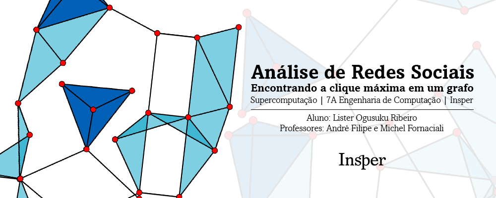

### Sobre o projeto:

**Desenvolvedor:** Lister Ogusuku Ribeiro

**Disciplina:** Supercomputação (7º semestre - Eng. Computação)

**Professores:** André Filipe e Michel Fornaciali

O projeto está documentado na íntegra no arquivo .pdf intitulado [_"Relatorio_Final_Projeto_Supercomp_Lister_Ogusuku_Ribeiro.pdf"_](https://github.com/listerogusuku/Graph-Maximum-Clique/blob/main/Relatorio_Final_Projeto_Supercomp_Lister_Ogusuku_Ribeiro.pdf) presente neste repositório.

### Execução e compilação:

O código-fonte para geração do grafo está disponível no arquivo _entrada.py_, o qual gera um _.txt_ como output.

Para verificar se foi encontrada a clique correta, será necessário utilizar o código _output.py_.

#### heuristica.cpp - Heurística da Busca Exaustiva:

```cpp
g++ heuristica.cpp -o heuristica
./heuristica grafo_output.txt
```

#### threads_omp.cpp - Implementação OpenMP:

```cpp
g++ threads_omp.cpp -fopenmp threads
./threads grafo_output.txt
```

#### mpi.cpp - Implementação MPI (no cluster):

```cpp
mpic++ mpi.cpp -o mpi
```

Antes de ir para o próximo passo, lembre-se de verificar se o seu arquivo .slurm está correto

```cpp
sbatch mpi.slurm
```

```cpp
cat slurm-[job-id].out
```
